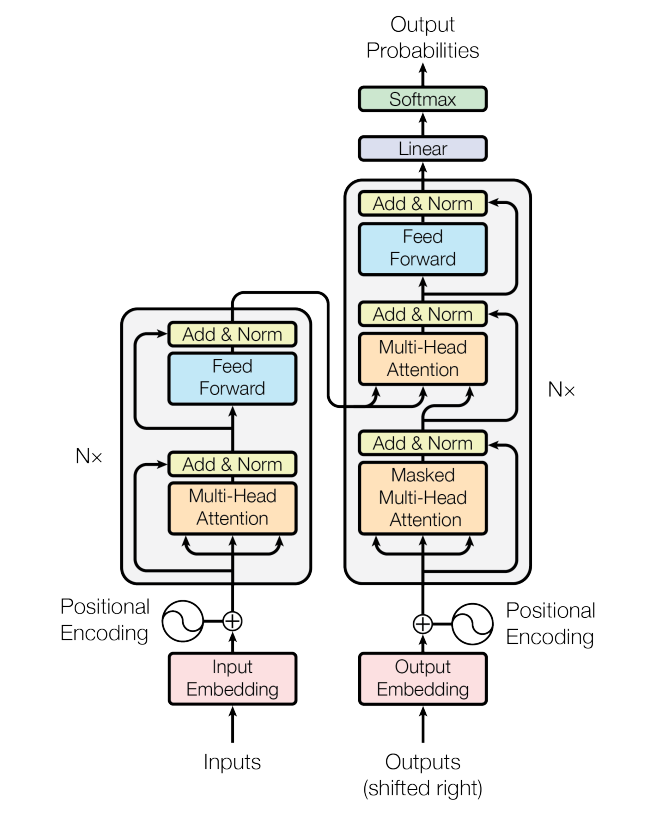

> 기존 연구는 어떻게 진행되어 왔는데(background),  
> 아직 이 부분에 대해서는 너무 부족해(motivaiton).  
> 그래서 우리는 이렇게 해결해보려고(contribution)  
> 이런 방법을 적용했어(method) 그 결과는 이렇고(result)  
> 그 이유는 우리가 제안한 ~ 때문이야(discussion)  

# Abstract
기존의 시퀀스 변환 모델:  
* 복잡한 반복이나 CNN
* attention 메커니즘을 포함한 encoder decoder 구조

그래서 **Transformer**을 제안
* 오로지 attention 메커니즘을 기반으로 함
* 수평적임(parallelizable)
* 훈련에 적은 시간 소요

***

# 1. Introduction
RNN, CNN, 그리고 최신 기술의 한계:
* 입력, 출력 데이터의 시퀀스를 계산함 --> hidden state의 시퀀스를 만들게 되는데, 시퀀스가 길어지게 되면 수평적이지 않고, 메모리의 한계가 발생함.
* 최근 연구에서는 분해하는 방법(factorization tricks)이나 조건부 연산(conditional computation)을 사용하기도 했는데, 여전히 시퀀스 연산에 대한 제약이 있음.

***

# 2. Background
Goal: 시퀀스 연산을 줄이고자 함

기존의 모델들 (ByteNet, ConvS2S): 합성곱 연산을 수행함
* 이는 입력과 출력의 데이터 쌍의 거리에 따라 연산의 수가 달라짐 --> 거리가 멀어질수록 학습을 더 어렵게 만들음.
  * ConvS2S: 선형적
  * ByteNet: 로그적

**Transformer**은 이러한 연산수를 상수로 줄임
* 연산의 수를 줄임에 따라서 해상도의 감소가 있지만, 이는 추후 **Multi-head Attention** 기법으로 보완할 것임

***

# 3. Model Architecture

* encoder decoder 구조로 되어있음
* stacked self-attention
* point-wise, fully conneted layers

## 3.1 Encoder and Decoder Stacks
### Encoder(N = 6)
* 입력 시퀀스(x1, ..., xn) 를 연속적인 표현으로 매핑 z = (z1, ..., zn)
* 각각의 layers는 두개의 sublayers가 있음
  1. multi-head self-attention mechanism
  2. position-wise fully connected feed-forward network
* 각각의 sublayers를 통과하면 residual connection, layer normalization이 뒤따름

최종 아웃풋  
==> LayerNorm(x + Sublayer(x))
* dimension = 512

### Decoder(N = 6)
* 세 개의 sub-layers
  1. multi-head self-attention mechanism
  2. position-wise fully connected feed-forward network
  3. masked multi-head attention
     * i 번째 prediction에 대해 i 이후의 값을 참고하지 않게 함(masking)
* encoder과 마찬가지로, 각 sublayers에 대해 residual connection, layer normalization이 뒤따름

## 3.2 Attention

쿼리를 매핑  
key-value 쌍을 결과로 출력, 결과는 value의 가중합으로 계산됨  
각각의 value에 대한 가중치는 q, k 사이 compatibility function(호환성 함수, 예: dot-product)으로 계산됨 

**핵심 변수**  
쿼리(Query)
* 입력된 특정 데이터 포인트(예: 현재 단어 또는 토큰)를 표현하는 벡터.
* "무엇을 찾고 싶은지"를 나타냄.

키(Keys)
* 데이터 포인트 전체를 나타내는 벡터 집합에서 각 데이터 포인트의 특징을 나타냄.
* "이 데이터 포인트가 중요한지 판단하기 위한 기준" 역할.

값(Values)
* 실제로 반환할 정보(데이터 포인트의 표현)를 담고 있는 벡터.
* 쿼리가 어떤 키에 주목했는지에 따라 가중치를 받아서 출력에 반영됨.

Attention 동작 과정
1. 쿼리가 입력으로 주어짐.
2. 쿼리와 각 키의 호환성을 계산하여 가중치를 생성.
3. 값들(values)에 가중치를 곱해 가중합을 계산.
4. 최종적으로, 이 가중합이 출력으로 반환.

### 3.2.1 Scaled Dot-Product Attention
* q, k의 dim = $d_k$
* v의 dim = $d_v$

1. q, k의 dot product 계산
2. 각각을 $\sqrt{d_k}$ 로 나누고(scaling factor), softmax 적용하여 values의 가중치 계산

> 즉 q, k는 v의 가중치를 구하기 위해 사용되는 값

Attention$(Q, K, V)$ = softmax$(\frac{QK^T}{\sqrt{d_k}})V$

> **주요 Attention 매커니즘**  
> * Additive Attention: q, k를 선형 변환 후, 비선형 활성화 함수를 사용하여 계산
> * Dot-Product Attention: q, k의 점곱 후 scale
>   
> Dot-Product Attention은 계산량이 적고, GPU/TPU에서 병렬 처리하기에 적합하여 현대적 모델에서 주로 사용

Attention 메커니즘은 Dot-Product Attention 채택(faster, space-efficient)

### 3.2.2 Multi-Head Attention
매커니즘 요약
1. 쿼리, 키, 값을 h개의 **헤드(head)**로 나누어 여러 개의 독립적인 어텐션 계산을 수행
2. h개의 헤드에서 나온 결과를 concat 후, 다시 선형 변환을 하여 최종 결과 생성

* 모델이 서로 다른 표현 하위 공간(representation subspaces)에서 다양한 위치의 정보를 동시에 주목(attend)할 수 있도록 해줌
* 해당 논문에서는 head = 8

### 3.2.3 Applications of Attention in our Model
다음 세 가지 방법으로 Multi-Head Attention을 사용한다.
1. 어텐션 layers에서는 q는 이전의 decoder layers에서 나오고, memory keys과 v는 인코더의 아웃풋으로부터 나온다. --> 이는 디코더가 인풋 시퀀스의 모든 자리를 접근할 수 있도록 한다.
2. 셀프 어텐션 레이어에서 키(keys), 값(values), 쿼리(queries)는 모두 동일한 곳, 즉 인코더의 이전 레이어 출력에서 나온다.
3. 디코더의 셀프 어텐션 레이어에서는 미래의 정보(leftward information flow)를 보지 않아야 하기 때문에 해당 정보에 대해서 masking 작업을 실시한다. (-∞ 로 설정. 이 경우 softmax 연산을 할 때 값이 제거된 것으로 판단 가능)

> **비유로 표현한 Self Attention(회의)**  
> * 모든 참석자(입력 시퀀스의 각 위치)는 서로의 말을 경청하며(주목) 새로운 아이디어(출력 표현)를 만들어낸다.
> * 이 과정에서 각 참석자(Q)는 다른 참석자(K)와의 연관성을 평가하고, 그에 따라 중요한 정보(V)를 반영해 자신만의 생각(출력)을 만들어낸다.

## 3.3 Position-wise Feed-Forward Networks

FFN($x$) = max($0, xW_1 + b_1$)$W_2 + b_2$
* Self-Attention이 시퀀스 전체를 다룬다면, 피드포워드 네트워크는 시퀀스 내 각 위치에 독립적으로 적용됨, 위치 간의 상호작용은 없음
  * 예) 문장이 "The cat sat on the mat"라면, FFN은 각각의 단어에 대해 동일한 연산을 수행.
* 두 개의 선현 변환과 그 사이에 ReLU 활성화 함수로 구성됨
  * 첫 번째 선형 변환: 입력의 차원을 확장
  * ReLU 활성화 함수: 비선형성을 추가
  * 두 번째 선형 변환: 확장된 차원을 다시 원래 차원으로 줄임
* Self-Attention 서브레이어에서 얻어진 정보를 추가적으로 변환하여 더 복잡한 패턴을 학습할 수 있도록 함(단어의 표현이 더 정교해지고, 최종적으로 더 나은 결과를 도출)
* CNN에서의 커널크기 = 1로 이해할 수 있음 
* FNN의 입력 및 출력 차원은 512, 내부 레이어 차원은 2048. 즉 차원이  확장되었다가 다시 축소됨 

> **비유로 표현한 FFN**
> * Self-Attention은 모든 단어가 함께 브레인스토밍하는 단체 회의라면,
> * FFN은 각 단어가 자신의 아이디어를 정리하고 다듬는 개별 워크숍임.

## 3.4 Embeddings and Softmax
* 입력 토큰과 출력 토큰을 임베딩 벡터로 변환하여 모델이 처리함($d_{model}$)
* 모델은 입력 임베딩과 출력 임베딩을 위한 가중치 행렬을 공유함 --> 이는 곧 파라미터의 수를 줄이는 것이 됨(효율성 높아짐)
* 디코더에서 Softmax 함수를 사용하여 다음 토큰에 대한 예측 확률을 계산

## 3.5 Positional Encoding
토큰의 순서 정보를 활용하기 위해서는 이와 관련된 정보를 주입해야 함 --> 'positional encodings' 을 input embeddings에 추가(encoder, decoder bottom에)
* 차원은 embeddings와 동일한 $d_{model}$
* 짝수 인덱스, 홀수 인덱스에 대해서 서로 다른 값을 할당함(위치 인코딩 계산)
  * $PE_{(pos, 2i)} = sin(pos/10000^{2i/d_{model}})$
  * $PE_{(pos, 2i+1)} = cos(pos/10000^{2i/d_{model}})$
* 사인과 코사인 함수는 상대적인 위치 차이를 선형적인 방식으로 표현할 수 있게 하여, 모델이 상대적 위치를 더 잘 학습할 수 있게 함

> **주파수?**  
> * 낮은 차원의 주파수는 큰 범위(예: 첫 번째 단어와 가장 마지막 단어)의 위치 관계를 잘 표현하고, 높은 차원의 주파수는 작은 범위의 위치 차이(예: 바로 옆에 붙어있는 단어)를 정확하게 표현함.
> * 이 설정을 통해, 모델은 위치 정보를 다양하고 효과적으로 인코딩할 수 있음.

* learned positional embeddings(학습된 위치 임베딩) 방식과 비교했을 때, 사인 코사인 방식과 성능이 거의 동일하여 해당 모델에서는 사인 코사인 방식을 채택함.

> **Sinusoidal Positional Encoding vs Learned Positional Embeddings**  
> **Sinusoidal Positional Encoding** 
> * 고정된 함수에 의해 위치 정보를 인코딩하는 방식
> * 각 단어(토큰)의 위치가 사인(sin)과 코사인(cos) 함수로 변환, 주기적
> * 훈련 데이터에서 본 적 없는 길이의 시퀀스에 대해서도 잘 일반화 함
> 
> **Learned Positional Embeddings**
> * 훈련 과정에서 각 위치에 대해 특정 임베딩 벡터를 학습하는 방식
> * 위치에 대해서 고유한 임베딩을 학습
> * 훈련 데이터에서 본 적 없는 위치에 대해서는 성능이 떨어질 수 있음

***

# 4. Why Self-Attention
RNN, CNN, Self-Attention의 공통점: 모두 하나의 가변 길이 시퀀스를 다른 동일한 길이의 시퀀스로 변환하는데 사용  
하지만, RNN, CNN과 비교하여 **Self-Attention** 방식이 더 적합한 이유 <u>세가지</u>:
1. 각각의 layer 의 총 계산복잡도(Computational Complexity)
   * Attention: 계산은 복잡($O(n^2)$) 하지만 효율적이다(?)
2. 병렬적으로 수행될 수 있는 연산의 양(Parallelization)
   * Attention: 각 단어가 다른 단어와 동시에 연결될 수 있어 병렬화가 용이
   * RNN: 순차적 계산이 필수
3. 네트워크 내에서 긴 거리 의존성(long-range dependencies)을 연결하는 경로 길이(Learning Long-Range Dependencies)
   * Attention: 각각의 단어들이 직접적으로 연결되어있어 경로가 짧고 학습이 용이
   * RNN: 정보를 순차적으로 처리하므로 장기 의존성 문제 발생

* Separable Convolutions에서 k=n의 경우, 복잡도는 Self-Attention 레이어와 점별(Point-wise) Feed-Forward 레이어의 복잡도를 합한 것과 같아짐(이 모델에서 채택한 방식)
* 추가적으로, Self-Attention은 해석 가능한 모델을 제공할 수 있음(Attention 분포 분석 등)

***

# 5. Training
## 5.1 Training Data and Batching
English-German
* training data set: WMT 2014 English-German dataset
  * 4.5 million sentence pairs
  * BPE(Byte-Pair Encoding) 방식으로 약 37,000개의 공유 어휘를 구성
  * source-target: 37000 tokens

English-French
* training data set: WMT 2014 English-French dataset
  * 36M sentences
  * 워드피스(Word-Piece) 방식으로 32,000개의 어휘집 생성
  * source-target: 25000 tokens

> **BPE(Byte-Pair Encoding)**  
> 원래는 데이터 압축 알고리즘으로 사용되었지만, NLP에서 토큰화 방식으로 확장됨.  
> 자주 등장하는 문자 또는 문자 시퀀스 쌍을 결합해 새로운 서브워드를 생성. 
> * 문자 쌍 빈도를 기반으로 서브워드를 생성하므로, 언어의 문법적 정보는 고려하지 않음
>
> 작동 방식  
> 1. 모든 단어를 문자(character) 단위로 분리
>   * 예: machine → m a c h i n e
> 2. 가장 많이 나타나는 문자 쌍(예: c와 h)을 하나의 서브워드로 결합
>    * 예: m a c h i n e → m a ch i n e
> 3. 이를 반복해 자주 사용되는 문자 쌍을 점점 더 긴 서브워드로 만듦
>    * 예: m a ch i n e → ma ch i ne → mach ine
> 4. 원하는 어휘 크기가 될 때까지 반복

> **Word-Piece**  
> Google의 BERT 모델에서 사용된 방식으로, BPE와 비슷하지만 언어 모델 학습 과정에서 확률적 정보를 활용함.  
> 서브워드를 생성할 때, 전체 단어 시퀀스에서 최대 우도(MLE, Maximum Likelihood Estimation)를 기준으로 서브워드를 분할
> * BPE보다 더 정교하게 서브워드를 생성하므로, 단어 분할이 문맥에 적합할 가능성이 높음
> 
> 작동 방식
> 1. 전체 텍스트를 문자 단위로 분리
> 2. 가능한 모든 서브워드를 생성한 뒤, 이 서브워드가 데이터에 나타날 확률을 계산
> 3. 언어 모델의 우도를 높이는 서브워드를 선택하며 어휘를 확장
> 4. 특정 빈도 이하로 나타나는 희귀 서브워드는 분할하지 않고 문자 단위로 남김  
> 예) unbelievable --> un, ##believe, ##able
>   * ##는 해당 서브워드가 이전 서브워드와 연결됨을 나타냄

## 5.2 Hardware and Schedule
one machine with 8 NVIDIA P100 GPUs  
each training step took about 0.4 seconds
* base model: 12h (100,000 steps)
* big model: 3.5d (300,000 steps)

## 5.3 Optimizer
* Adam

## 5.4 Regularization
세 가지 Regularization
1. Residual Dropout: 각 sublayer의 output 마다 추가
2. encoder, decoder의 sum of embeddings, positional encodings에 추가
3. Label Smoothing: 모델을 불확실하게 학습하도록 만들지만 acc, BLEU score이 상승
   * perplexity 악화

***

# 6. Results
## 6.1 Machine Translation
big transformer model이 
* WMT 2014 English-to-German translation task
* WMT 2014 English-to-French translation task

에서 뛰어난 성적을 보였고, base model조차도 이전 모델의 성능을 뛰어넘음

* base model: average of the last 5 ckpt
* big model: average of the last 20 ckpt

## 6.2 Model Variations
변화한 파라미터들
* $h$: head 가 너무 많아도 성능이 떨어짐 --> 적절한 값을 찾는 것이 중요
* $d_k$: key size가 많을수록 성능 증가 --> dot product보다 정교한 compatibility function이 더 효과적임
* embedding 방법 변경: positional embedding을 사용했을때의 성능은 base과 비슷하게 나옴 

## 6.3 English Constituency Parsing
모델의 일반화 성능을 평가하기 위해 **영어구성 구문 분석(English constituency parsing)** 진행  
dataset
* Penn Treebank의 Wall Street Journal(WSJ)
  * 40,000개의 학습 문장 포함
* BerkleyParser corpora
  * 17M 문장

Recurrent Neural Network Grammar 모델을 제외하고는 나머지 모델보다 성능이 높게 나옴

***

# 7. Conclusion
의의
* 우리가 제안한 Transformer 모델은 온전히 Attention 에 의존한 sequence transduction model임.
* 이는 RNN, CNN 보다 빠르게 학습하고, 성능 면에서 new state of the art 을 달성하였음

Goal
* 이미지, 음성이나 비디오와 같이 더 큰 input과 output 다루기
* 생성에 있어 이를 덜 순차적(less sequential)으로 하기