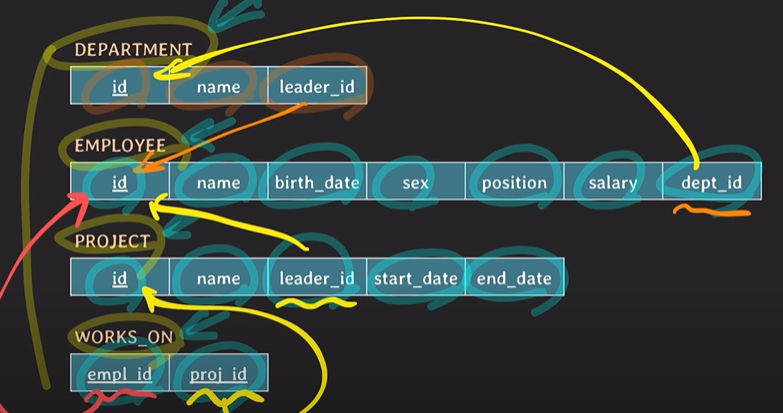
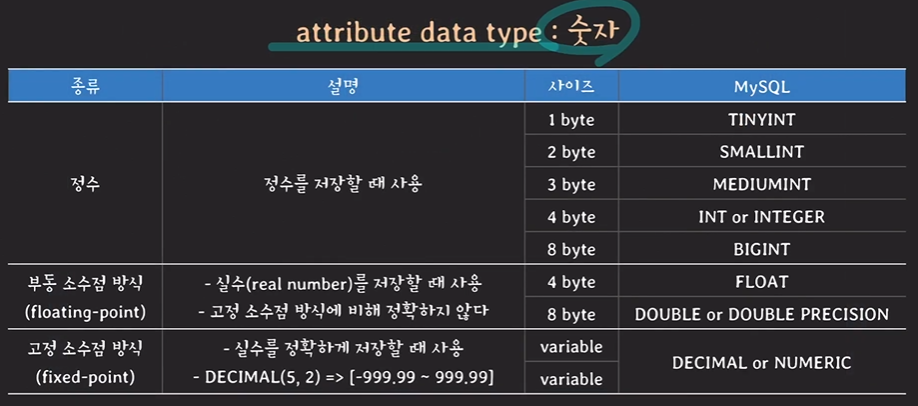
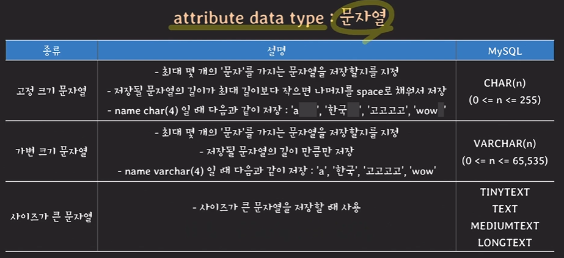
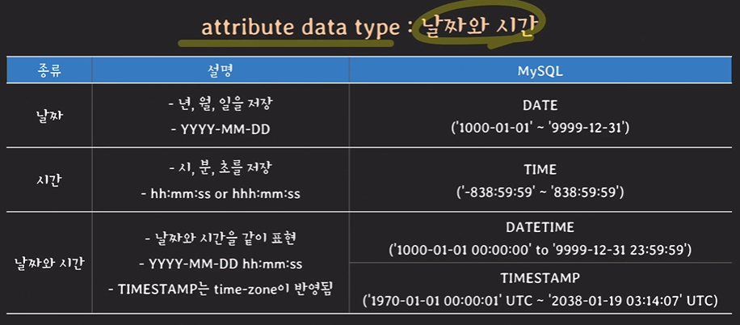

## SQL로 데이터 처리하기(1)

### 데이터베이스 생성하기

#### SQL이란?
* Structured Query Language
* 관계형 DBMS의 표준 언어
* 종합적인 DB언어(DDL + DML + VDL)

#### SQL 주요 용어

| relational data model | SQL   |
|---|-------|
|relation | table |
| attribute| column |
|tuple | row |
|domain | domain |


### SQL문을 활용한 데이터베이스 관리
> 적용할 예제: IT회사 관련 RDB만들기<br/>
> 부서, 사원, 프로젝트 관련 정보들을 저장할 수 있는 RDBMS 만들기

#### MySQL 기본적인 Query
* SHOW DATABASES; 나의 모든 DB를 보여줌: 
* CREATE DATABASE ~생성할 DB 이름~; : DB 생성
* USE ~사용할 DB 이름~; : 어떤 DB를 사용할 것인지 선택 
* SELECT database(); : 현재 선택된 DB를 보여줌
* ALTER TABLE ~ : table의 schema를 변경하고 싶을 때 사용 
  * ADD, RENAME COLUMN ~ TO, MODIFY COLUMN, RENAME TO, ADD PRIMARY KEY
  * 이미 서비스 중인 table를 변경하는 것이므로 변경했을 시 다른 서비스에 영향이 없는지 확인하고 변경하는 것이 중요
* DROP TABLE ~테이블 이름~; :테이블을 삭제 

> MySQL에서의 DATABASE vs SCHEMA<br/>
> MySQL에서는 DATABASE와 SCHEMA가 같은 뜻을 의미 
> ex) CREATE DATABASE ~ 와 CREATE SCHEMA ~ 가 같은 뜻을 의미


#### Table 정의하기
부서(department), 직원(employee), 프로젝트(project) 관련 정보들을 저장



[DEPARTMENT 테이블 생성]

```mysql
CREATE TABLE DEPARTMENT (
    id INT PRIMARY KEY,
    name VARCHAR(20) NOT NULL UNIQUE,
    leader_id INT 
);
```

#### attribute data type





* MySQL에서의 TIMESTAMP는 TIMEZONE의 영향을 받음

그 외 attribute data type
* boolean: MySQL에서는 존재하지 않음. TINYINT로 대체


#### PRIMARY KEY
* table의 tulpe을 식별하기 위해 사용
* 하나 이상의 attribute(s)로 구성
* 중복된 값을 가질 수 없음
* NULL값이 올 수 없음

[PRIMARY KEY 선언 방법]

| attribute이 하나인 경우  |attribute이 두개 이상인 경우|
|--------------------|---|
| id INT PRIMARY KEY |PRIMARY KEY (team_id, back_number)|


#### UNIQUE
* UNIQUE로 지정된 attribute(s)는 중복된 값을 가질 수 없음
* NULL은 중복 가능


#### NOT NULL
* NOT NULL로 지정된 attribute(s)는 NULL 값을 가질 수 없음
* 보통 NOT NULL과 UNIQUE를 같이 사용 

[EMPLOYEE 테이블 생성]

```mysql
CREATE TABLE EMPLOYEE (
    id INT PRIMARY KEY,
    name VARCHAR(30) NOT NULL,
    birth_date DATE,
    sex CHAR(1) CHECK(sex in ('M', 'F')),
    position VARCHAR(10),
    salary INT DEFAULT 50000000,
    dept_id INT,
    FOREIGN KEY (dept_id) references DEPARTMENT(id) on delete SET NULL on update CASCADE,
    CHECK (salary >= 50000000)
);
```

#### DEFAULT
* 새로운 tuple를 지정할 때 해당 attribute에 대한 값이 없다면 default값으로 저장


#### CHECK
* attribute 값을 제한하고자 할 때 사용


#### FOREIGN KEY
* attribute(s)가 다른 테이블의 PK나 UNIQUE KEY를 참조할 떄 사용
* 참조를 할 테이블에 현재 FOREIGN KEY와 동일한 값이 있어야 함
* references ~테이블 이름~ 으로 참조를 할 테이블 지정
* 참조하고 있는 값이 삭제(on delete) 되었을 때, 변경(on update)되었을 때 상황 처리를 지정해 주어야 함
  > FOREIGN KEY (id) references ~테이블 이름~(id) on (delete/update) reference_option
  > > reference_option
  > > * CASCADE: 참조 값의 삭제/변경 그대로 반영
  > > * SET NULL: NULL로 변경
  > > * RESTRICT: 참조값의 삭제/변경 금지
  > > * NO ACTION: 참조값의 삭제/변경 금지
  > > * SET DEFAULT: default 값으로 변경

> constraint 이름 명시하기
> * 이름을 붙임으로써 어떤 constraints을 위반했는지 쉽게 파악 가능
> * constraint를 삭제하고 싶을 때 해당 이름으로 삭제 가능

[PROJECT 테이블 생성]

```mysql
create table PROJECT (
    id INT PRIMARY KEY,
    name VARCHAR(20) NOT NULL UNIQUE,
    leader_id INT,
    start_date DATE,
    end_date DATE,
    FOREIGN KEY (leader_id) references EMPLOYEE(id) on delete SET NULL on update CASCADE,
    CHECK (start_date < end_date)
);
```

[WORKS_ON 테이블 생성]

```mysql
create table WORKS_ON (
    empl_id INT,
    proj_id INT,
    PRIMARY KEY (empl_id, proj_id),
    FOREIGN KEY (empl_id) references EMPLOYEE(id) on delete CASCADE on update CASCADE,
    FOREIGN KEY (proj_id) references PROJECT(id) on delete CASCADE on update CASCADE
);
```

[DEPARTMENT 테이블 추가 수정]

```mysql
ALTER TABLE DEPARTMENT ADD FOREIGN KEY (leader_id)
    REFERENCES employee(id) on update CASCADE on delete SET NULL;
```

> DB구조를 정의할 때 중요한 점
> 만들려는 서비스의 스펙과 데이터 일관성, 편의성, 확장성 등등을 종합적으로 고려하여 DB schema를 적절하게 정의하는 것


### 테이블에 데이터 추가/수정/삭제하기

#### 데이터 추가하기
```mysql
INSERT INTO EMPLOYEE
    VALUES(1, "MESSI", "1987-02-01", "M", "DEV_BACK", 100000000, null);
```
* 처음 정의한 순서대로 value안에 값을 넣어줘야 함
* 가장 마지막 항목에 경우 아직 DEPARTMENT에서 참조할 항목이 없으므로 null 값을 넣어줌

```mysql
INSERT INTO employee (name, birth_date, sex, position, id)
    VALUES("JENNY", "2000-10-12", "F", "DEV_BACK", 3);
```
* 위와 같이 괄호 안에 매개변수를 주면 입력의 자유도를 증가시킬 수 있음
* 이때 JENNY의 연봉은 default 값으로 설정한 50000000임


[테이블 확인하기]
```mysql
select *FROM employee;
```


#### 데이터 수정하기(UPDATE)
Messi의 dept_id는 현재 null값임
```mysql
UPDATE employee SET dept_id=1003 WHERE id=1;
```
UPDATE ~테이블 이름~ SET ~바꿀려는 열과 값~ WHERE ~어떤 행의 특정 값;~
* UPDATE ~어느 테이블에 대해서~
* 값을 세팅할 때 SET 사용
* WHERE 뒤에 조건절(~에 대해서) 기입

[행을 부분적으로 확인]
```mysql
select * FROM employee WHERE id=1;
```

[특정 값 *2배]
```mysql
UPDATE employee SET salary = salary * 2 WHERE dept_id=1003;
```

[두 개의 테이블 이용하기]
```mysql
UPDATE employee, works_on SET salary = salary * 2 WHERE id = empl_id and proj_id = 2003;
```
```mysql
UPDATE employee, works_on SET salary = salary * 2 WHERE employee.id = works_id.empl_id and works_on.proj_id = 2003;
```
* and 로 연관된 테이블을 다 적어줌
* 하단의 방법처럼 테이블을 명시해도 됨(혼동 방지)

[행 삭제하기]
```mysql
DELETE FROM employee WHERE id=8;
```
* 다른 테이블(works_on)에서도 같은 아이디를 사용하고 있지만 처음 만들 때 EMPLOYEE 테이블의 id값을 reference 하도록 지정했는데, 이때 on delete 시 CASCADE하도록 지정하였기 때문에 employee 테이블에서 해당 id를 삭제하면 works_on 테이블에서도 자동적으로 삭제가 됨.(이를 지우기 위한 별도의 SQL문이 필요 없음)
* id 값이 중복이라면 해당 id값을 가진 모든 튜플이 삭제

[특정 값 제외하고 전부 삭제]
```mysql
DELETE FROM works_on WHERE id=5 and proj_id != 2001;
```
* id가 5인 사람의 proj_id가 2001을 제외하고 전부 삭제
* != 대신 <> 도 같은 의미(~를 제외하고)

[테이블 안의 모든 튜플 삭제]
```mysql
DELETE FROM project;
```
* where 문이 없음 -> 모든 데이터 삭제(주의!)


### 데이터 조회하기(SELECT)
[ID가 9인 임직원의 '이름(name)'과 '직군(position)'을 알고 싶음]
```mysql
SELECT name, position FROM employee WHERE id=9;
```
* SELECT 뒤의 선택된 attributions 만 가져옴
* 테이블 안의 조건 세부화를 원하는 경우 WHERE 뒤에 조건 기입
* SELECT attribute(s) FROM table(s) [WHERE condition(s)];

[project 2002를 leading하고 있는 임직원의 ID와 이름과 직군을 알고 싶음]
```mysql
SELECT employee.id, employee.name, employee.position
FROM project, employee
WHERE project.id=2002 and project.leader_id=employee.id;
```
* employee.id, employee.name, employee.position: projection attributes
* project.leader_id=employee.id: 두 개의 테이블을 연결시키는 조건 -> join condition
* project.id=2002: selection condition
* 테이블 이름을 적어준 이유: 명확성을 위함(각 테이블에 돌일한 'id'로 인해 충돌 발생)

#### 별칭 붙이기(AS)
* 테이블이나 attribute에 별칭을 붙일 때 사용
* 생략가능

```mysql
SELECT E.id, E.name, E.position
FROM project AS P, employee AS E
WHERE P.id=2002 and P.leader_id=E.id;
```
* SELECT에서도 바꾸어 주어야 함

[출력값에서 column 값 변경하여 출력]
```mysql
SELECT E.id AS e_id, E.name AS e_name, E.position AS e_pos
FROM project AS P, employee AS E
WHERE P.id=2002 and P.leader_id=E.id;
```
* AS 생략 가능


#### 중복 제거(DISTINCT)
* SELECT 결과에서 중복되는 튜플은 제외하고 싶을 때 사용 
```mysql
SELECT DISTINCT P.id, P.name
FROM project P, employee E, works_on W
WHERE E.position = "DSGN" and E.id = W.empl_id and W.proj_id = P.id;
```

#### (LIKE)

[이름이 N으로 시작하거나 끝나는 임직원들의 이름을 알고 싶음]
```mysql
SELECT name
FROM employee
WHERE name LIKE"N%" or name LIKE"%N";
```
* %: 0개 이상의, 임의의 개수를 가지는 문자를 의미(예약 문자)

[이름에 NG가 들어가는 임직원들의 이름을 알고 싶음]
```mysql
SELECT name
FROM employee
WHERE name LIKE "%NG%";
```

[글자 수 제한(J 포함 4자리)]
```mysql
SELECT name
FROM employee
WHERE name LIKE "J___";
```
* 언더스코어로 자릿수를 제한
* _: 하나의 문자를 의미(예약 문자)

> %나 _를 문자 본연으로 사용하고 싶다면?
> * 백슬래시(\) 다음에 문자를 써줌 ex) "\%", "\_"
> * \: escape 문자. 예약 문자를 escape시킴


#### 모든(*)
* 선택된 튜플의 모든 attributes를 보여주고 싶을 때 사용
```mysql
SELECT * FROM employee WHERE id=9;
```

#### SELECT without WHERE
* 테이블에 있는 모든 튜플을 반환

> 주의사항
> 1. SELECT로 조회 할 때 조건들을 포함해서 조회를 한다면 이 조건들과 관련된 attributes에 index가 걸려 있어야 함.(그렇지 않않을 경우 조회 속도가 느려짐)
> 2. 해당 내용은 MySQL 기준. 다른 RDBMS의 SQL 문법은 조금씩 다를 수 있음.
> 3. SELECT 외의 다른 기본적인 조회 기능도 많음.(알아서 공부할 것)

<br/>

***

### 강의 영상
시니어 백엔드 개발자가 알려주는 데이터베이스 개론 & SQL<br/>
[인프런: 데이터베이스 생성하기](https://www.inflearn.com/course/백엔드-데이터베이스-개론/unit/129799) <br/>
[인프런: 테이블에 데이터 추가/수정/삭제하기](https://www.inflearn.com/course/백엔드-데이터베이스-개론/unit/129800) <br/>
[인프런: 데이터 조회하기(select)](https://www.inflearn.com/course/백엔드-데이터베이스-개론/unit/129801?tab=curriculum)


