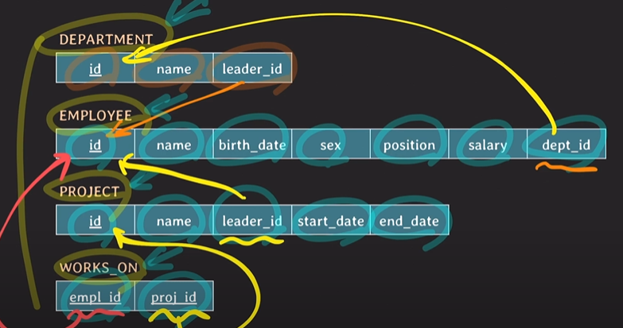
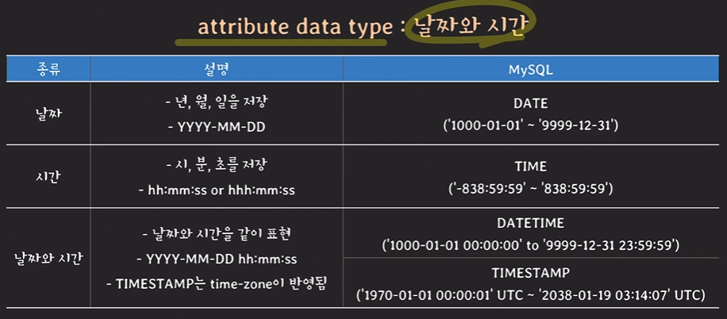

## 데이터베이스 생성하기 

### SQL

#### SQL이란?
* Structured Query Language
* 관계형 DBMS의 표준 언어
* 종합적인 DB언어(DDL + DML + VDL)

#### SQL 주요 용어
| relational data model | SQL    |
|-----------------------|--------|
| relation              | table  |
| attribute             | column |
| tuple                 | row    |
| domain                | domain |


### SQL문을 활용한 데이터베이스 관리
> 적용할 예제: IT회사 관련 RDB만들기<br/>
> 부서, 사원, 프로젝트 관련 정보들을 저장할 수 있는 RDBMS 만들기

#### MySQL 기본적인 Query
* SHOW DATABASES; 나의 모든 DB를 보여줌: 
* CREATE DATABASE ~생성할 DB 이름~; : DB 생성
* USE ~사용할 DB 이름~; : 어떤 DB를 사용할 것인지 선택 
* SELECT database(); : 현재 선택된 DB를 보여줌
* ALTER TABLE ~ : table의 schema를 변경하고 싶을 때 사용 
  * ADD, RENAME COLUMN ~ TO, MODIFY COLUMN, RENAME TO, ADD PRIMARY KEY
  * 이미 서비스 중인 table를 변경하는 것이므로 변경했을 시 다른 서비스에 영향이 없는지 확인하고 변경하는 것이 중요
* DROP TABLE ~테이블 이름~; :테이블을 삭제 

> MySQL에서의 DATABASE vs SCHEMA<br/>
> MySQL에서는 DATABASE와 SCHEMA가 같은 뜻을 의미 
> ex) CREATE DATABASE ~ 와 CREATE SCHEMA ~ 가 같은 뜻을 의미


#### Table 정의하기
부서(department), 직원(employee), 프로젝트(project) 관련 정보들을 저장



[DEPARTMENT 테이블 생성]

```mysql
CREATE TABLE DEPRTMENT (
    id INT PRIMARY KEY,
    name VARCHAR(20) NOT NULL UNIQUE,
    leader_id INT 
);
```

#### attribute data type



* MySQL에서의 TIMESTAMP는 TIMEZONE의 영향을 받음

그 외 attribute data type
* boolean: MySQL에서는 존재하지 않음. TINYINT로 대체


#### PRIMARY KEY
* table의 tulpe을 식별하기 위해 사용
* 하나 이상의 attribute(s)로 구성
* 중복된 값을 가질 수 없음
* NULL값이 올 수 없음

[PRIMARY KEY 선언 방법]

| attribute이 하나인 경우  |attribute이 두개 이상인 경우|
|--------------------|---|
| id INT PRIMARY KEY |PRIMARY KEY (team_id, back_number)|


#### UNIQUE
* UNIQUE로 지정된 attribute(s)는 중복된 값을 가질 수 없음
* NULL은 중복 가능


#### NOT NULL
* NOT NULL로 지정된 attribute(s)는 NULL 값을 가질 수 없음
* 보통 NOT NULL과 UNIQUE를 같이 사용 

[EMPLOYEE 테이블 생성]

```mysql
CREATE TABLE EMPLOYEE (
    id INT PRIMARY KEY,
    name VARCHAR(30) NOT NULL,
    birth_date DATE,
    sex CHAR(1) CHECK(sex in ('M', 'F')),
    position VARCHAR(10),
    salary INT DEFAULT 50000000,
    dept_id INT,
    FOREIGN KEY (dept_id) references DEPARTMENT(id) on delete SET NULL on update CASCADE,
    CHECK (salary >= 50000000)
);
```

#### DEFAULT
* 새로운 tuple를 지정할 때 해당 attribute에 대한 값이 없다면 default값으로 저장


#### CHECK
* attribute 값을 제한하고자 할 때 사용


#### FOREIGN KEY
* attribute(s)가 다른 테이블의 PK나 UNIQUE KEY를 참조할 떄 사용
* 참조를 할 테이블에 현재 FOREIGN KEY와 동일한 값이 있어야 함
* references ~테이블 이름~ 으로 참조를 할 테이블 지정
* 참조하고 있는 값이 삭제(on delete) 되었을 때, 변경(on update)되었을 때 상황 처리를 지정해 주어야 함
  > FOREIGN KEY (id) references ~테이블 이름~(id) on (delete/update) reference_option
  > > reference_option
  > > * CASCADE: 참조 값의 삭제/변경 그대로 반영
  > > * SET NULL: NULL로 변경
  > > * RESTRICT: 참조값의 삭제/변경 금지
  > > * NO ACTION: 참조값의 삭제/변경 금지
  > > * SET DEFAULT: default 값으로 변경

> constraint 이름 명시하기
> * 이름을 붙임으로써 어떤 constraints을 위반했는지 쉽게 파악 가능
> * constraint를 삭제하고 싶을 때 해당 이름으로 삭제 가능

[PROJECT 테이블 생성]

```mysql
create table PROJECT (
    id INT PRIMARY KEY,
    name VARCHAR(20) NOT NULL UNIQUE,
    leader_id INT,
    start_date DATE,
    end_date DATE,
    FOREIGN KEY (leader_id) references EMPLOYEE(id) on delete SET NULL on update CASCADE,
    CHECK (start_date < end_date)
);
```

[WORKS_ON 테이블 생성]

```mysql
create table WORKS_ON (
    empl_id INT,
    proj_id INT,
    PRIMARY KEY (empl_id, proj_id),
    FOREIGN KEY (empl_id) references EMPLOYEE(id) on delete CASCADE on update CASCADE,
    FOREIGN KEY (proj_id) references PROJECT(id) on delete CASCADE on update CASCADE
);
```

[DEPARTMENT 테이블 추가 수정]

```mysql
ALTER TABLE DEPARTMENT ADD FOREIGN KEY (leader_id)
    REFERENCES employee(id) on update CASCADE on delete SET NULL;
```

### DB구조를 정의할 때 중요한 점
만들려는 서비스의 스펙과 데이터 일관성, 편의성, 확장성 등등을 종합적으로 고려하여 DB schema를 적절하게 정의하는 것
